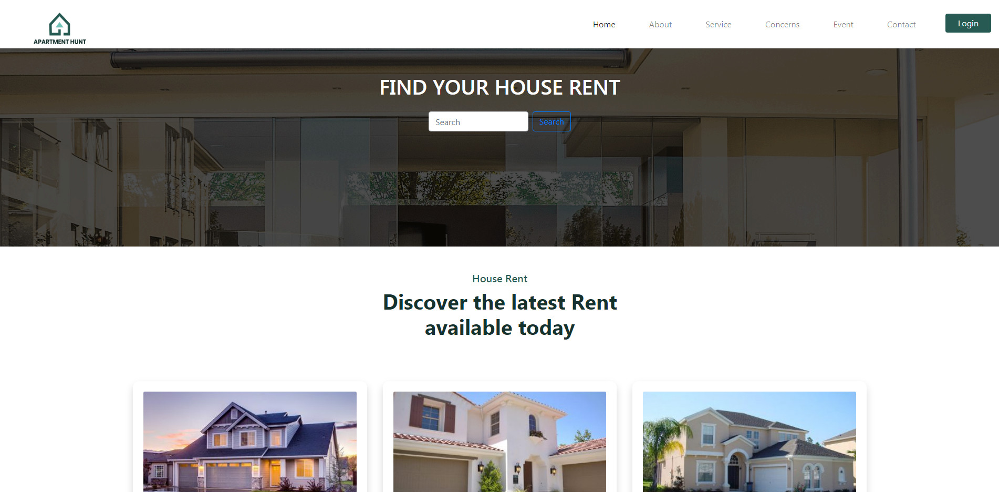
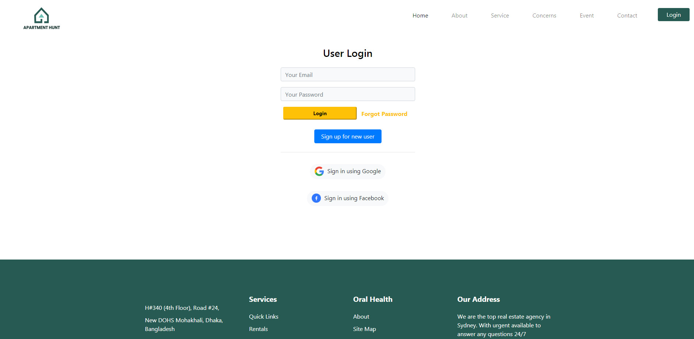
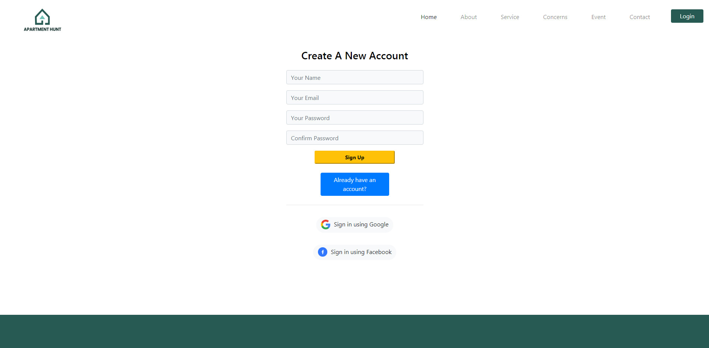

# Live Website Link : https://apartment-hunt-project.netlify.app/

# Project image

# Project Functionality
<ul>
  <li>Developed a dynamic , secure website from scratch .</li>
  <li>Used modern technology for better user experience</li>
  <li>People can show the price of apartment and can choose an apartment of your choice.</li>
  <li>Has a login and create account page for login or be able to sign up on the website</li>
  <li>Used react, redux, node.js, mongoDb, bootstrap, firebase, heroku and many more…</li>
</ul>
